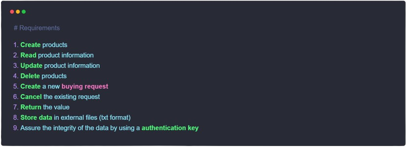

# Team: Step To the Future

## First release: Beta release 0.1

**What is new:**

- Product management is now working
- Authentication System is now working

### Briefing

**Project Description**

 The project is a simple CRUD solution for a local e-commerce system based in python. The solution involves the following steps:

#### Team Members:

>This team includes members that are an example of exceptional knowledge and experience, not to mention that each member are quite competent and dedicated to their objectives

Name | Role
:---- | :---
Abraão Filipi dos Santos | Team leader
Adriely Ribeiro | Team Coordinator
Diego Silva | Team Member
Fernanda Silva | Team Member

#### Our motto
> "For each code line, a step to the future.🚀"
> -- _Abraão Santos_

## Mission, Vision and Values

##### Our vision:

We are here to innovate the IT scenery with our knowledge and by purposing new solutions.

##### Our Mission:

Our goal is to create brand new solutions and help others to grow their knowledge and experience, not to mention the objective of helping people to have a better life quality through the Technology.

##### Our Values:

- Empathy
- Proactivity
- Union
- Respect
- Equality
- Inclusion
- Future perspective
- Responsibility
- Boldness
- Faith(can't miss)
